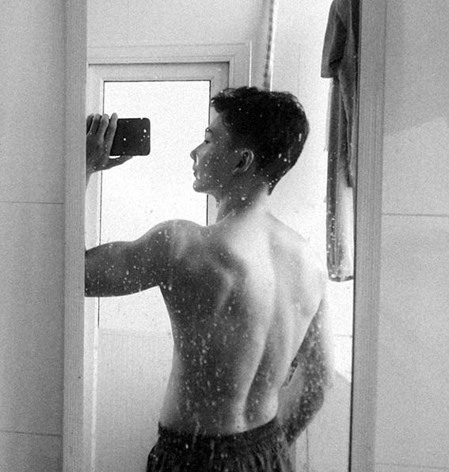

I am someone who loves sports. In middle school, I was passionate about table tennis. In high school, I took up basketball. However, being a person of a more leisurely temperament, I found that the constant running required in basketball wasn't quite right for me, so I didn't play much in college. During my university days, I would do basic strength training exercises daily in my dormitory. I even purchased relevant equipment, doing simple exercises like push-ups every day. However, I never really followed a structured routine.It was at the start of my postgraduate studies that, through an introduction by a new friend, I stepped into a gym for the first time. I fell in love with working out and officially embarked on my systematic training journey.

  

I began my systematic training on October 21, 2021. It's been less than two years since I started working out. In the first year, I followed a three-split routine, working out six days a week and resting one day. In the second year, I shifted to a five-split routine, working out five days and taking a day off, then starting the cycle over. Week after week, it was the same pattern. With such day-to-day consistency and repetition, both my body and mind have undergone significant transformations over these two years.

Physically speaking, fitness is one of those endeavors where you can see tangible results directly proportional to your effort. With daily persistence, I could witness visible improvements in my physique at a noticeable pace. However, the hardest part of fitness is the commitment. When you repeat an action for 365 days, and every day, the moment you pick up your backpack, you already know what comes next, that inherent monotony and mental fatigue is the reason many give up halfway. But without a doubt, if you choose to persist, fitness will never let your efforts go in vain.

Mentally, the two hours I spend in the gym each day are a sanctuary. I set aside all electronic devices and temporarily forget all my worries. My mind focuses solely on one thing: executing the current movement with precision. These two hours act as a refueling session after a tiring day. Sweating it out and then taking a shower after the training makes me feel rejuvenated, walking out of the gym filled with renewed vitality and hope. Furthermore, having a healthy body boosts my confidence and keeps me energized in daily life, effectively enhancing my work efficiency.

