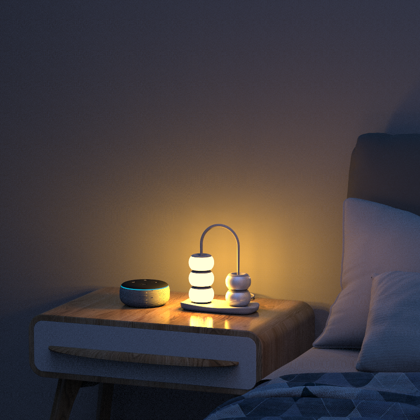
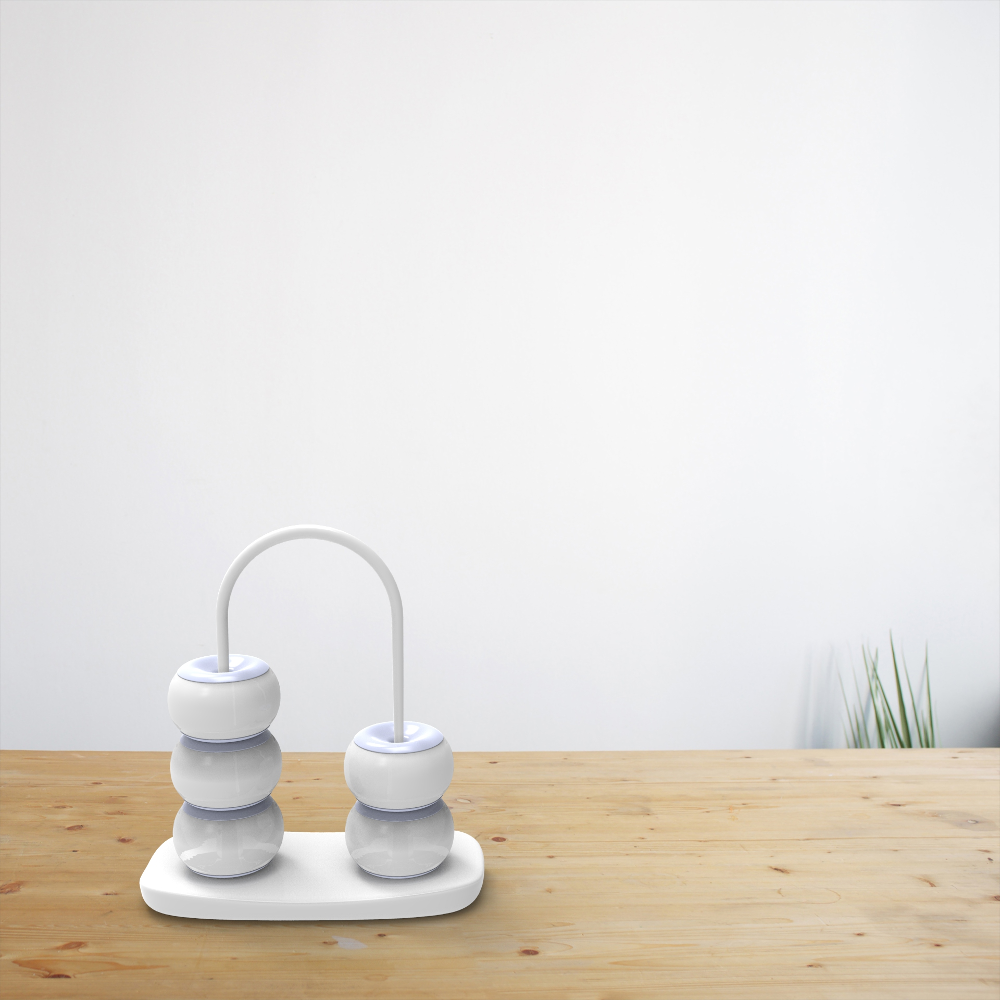
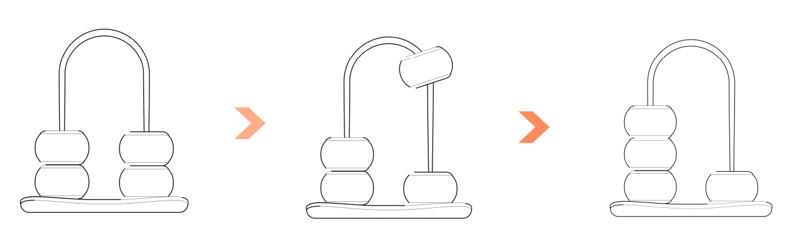
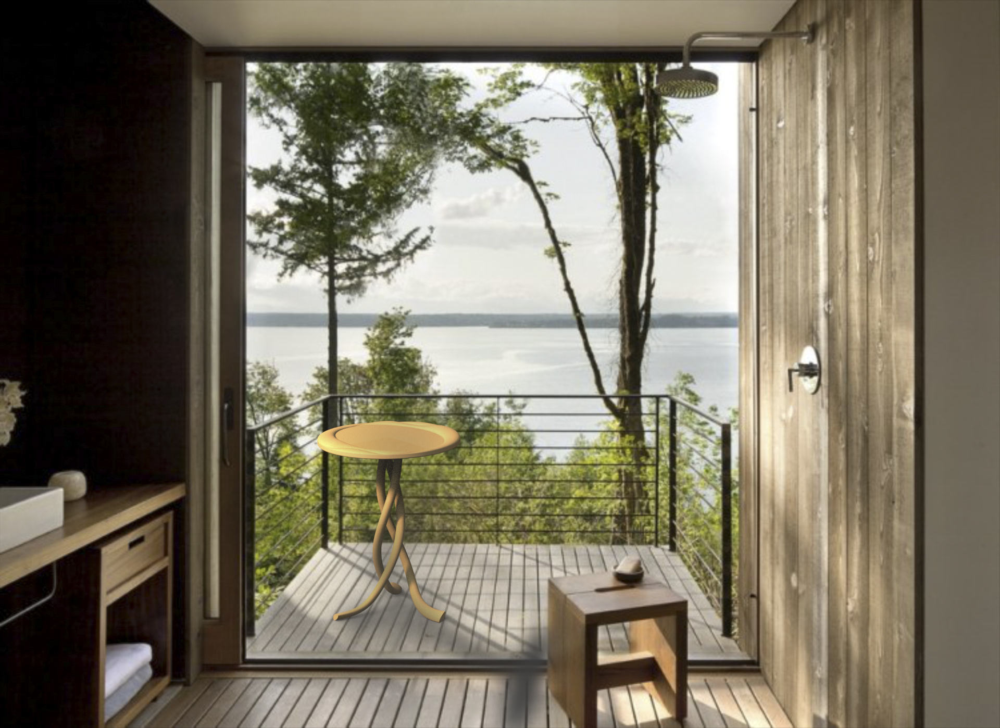
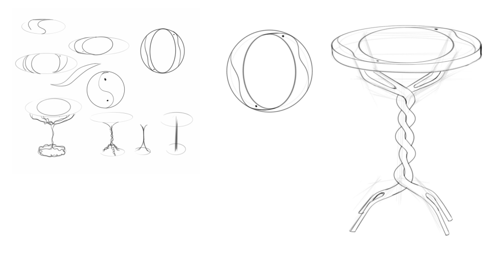
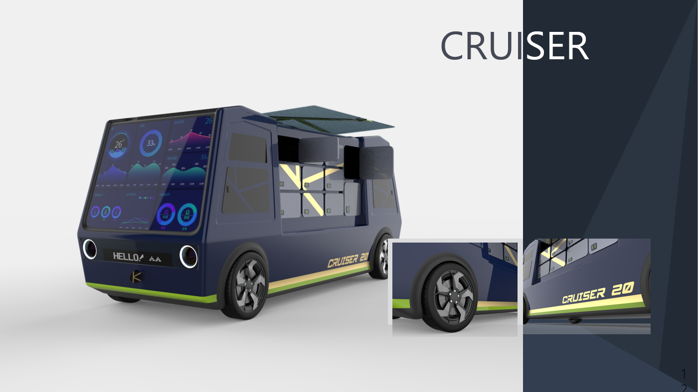
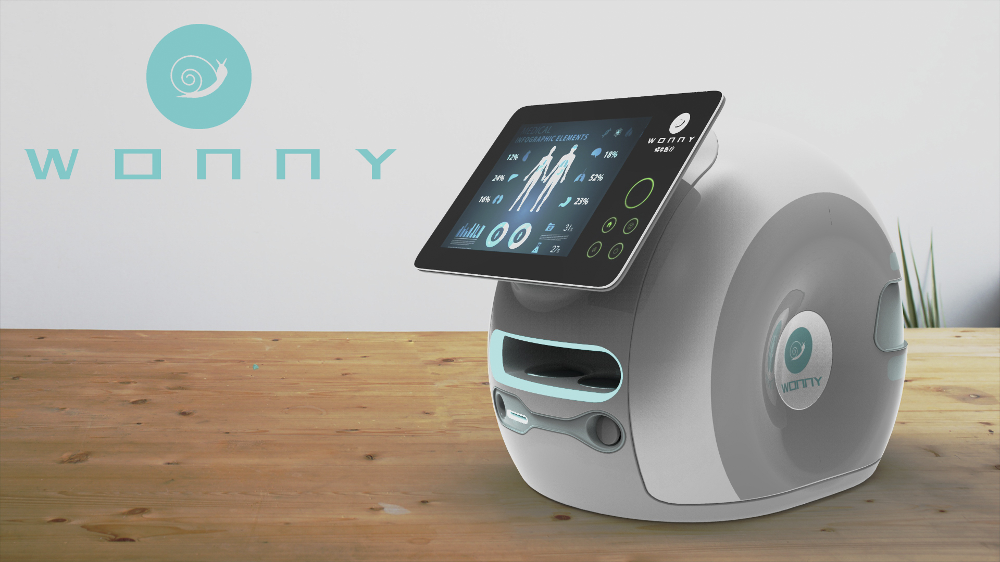
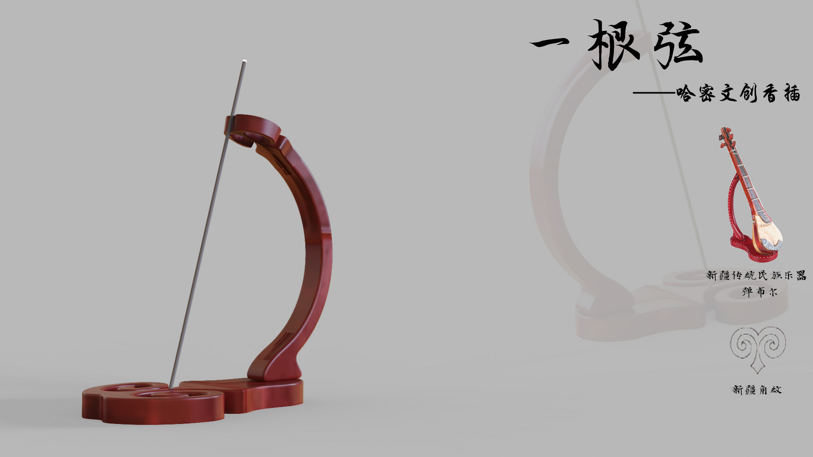

## "Abacus" Night Light
The inspiration for this design comes from the form of the traditional Chinese counting tool, the "abacus". The brightness of the light can be adjusted by sliding the beads left and right.

   

The light fixture is primarily divided into two parts, left and right, connected by an arch structure in the middle. This design allows the beads on both sides to slide, adjusting the brightness of the light based on the number of beads on the left side.

  

In terms of details, starting with the design of the beads, their overall shape is more rounded, resembling a full "persimmon". The smooth shape not only imparts a warm and gentle feeling, complementing the ambiance of the light fixture, but the overall design of the fixture also resembles a handheld fruit basket. The full persimmon shape evokes a sense of abundance and a warm atmosphere.

## "LOVE" Side Table
The design is inspired by the traditional Chinese poem which states, "In the sky, I wish to be birds flying side by side; on earth, I wish to be branches intertwined." In terms of design, the upper tabletop adopts the form of birds flying side by side, while the lower support is designed in the style of intertwined branches. The design of the top and bottom parts corresponds with the poetic sentiment. The overall shape and design is simple and intuitive, symbolizing people's unwavering love, evoking deep and passionate emotional responses.

   

## "Cruiser" Autonomous Delivery Vehicle
Addressing the 'last-mile' challenge of domestic express delivery, an autonomous delivery vehicle designed for communities has been introduced. The overall vehicle design is straightforward and clear, with robust and bold lines. The sapphire blue body further enhances its elegance and refinement.

  

## "Wanny" Home Medical Aid Product
The design was carried out against the backdrop of rural medical environments, aiming to assist elderly residents left behind in rural households to access medical care more effectively and to help improve the medical conditions in rural areas.

  

The design contemplates integrating some basic physical examination methods, while adopting 'Internet + Healthcare' smart technology to link data with major hospitals.

   
    

In terms of design, it adopts an appearance similar to that of a snail, featuring a sleek and lively style. Color-wise, while utilizing the customary black, white, and gray of medical products, details are embellished with blue-green accents, making the product overall more dynamic and fully embodying a sense of humanistic care.

## "A Single String" Incense Holder
The overall design of this piece draws inspiration from the traditional musical instruments of Xinjiang and the stands used to place them. Moreover, patterns unique to Xinjiang are incorporated into the design, further emphasizing the local cultural characteristics.

  

